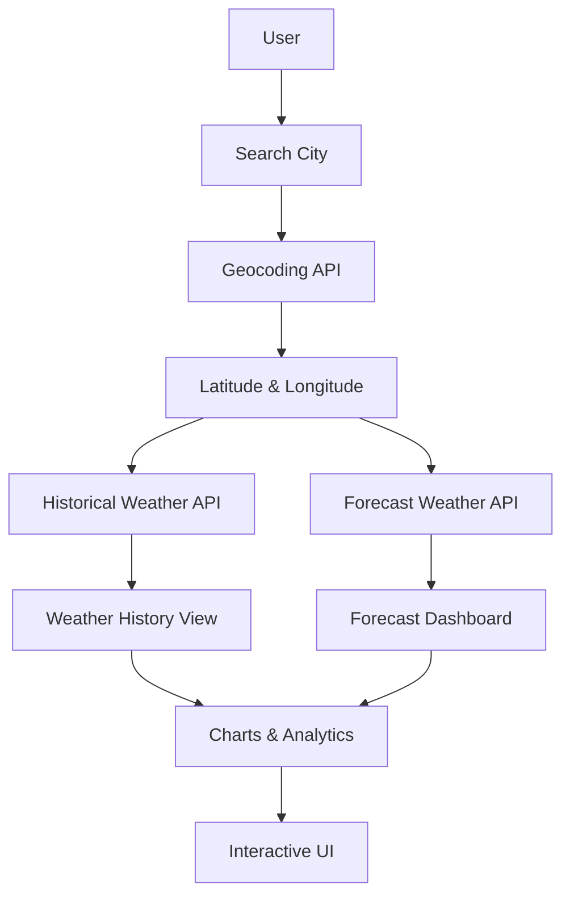
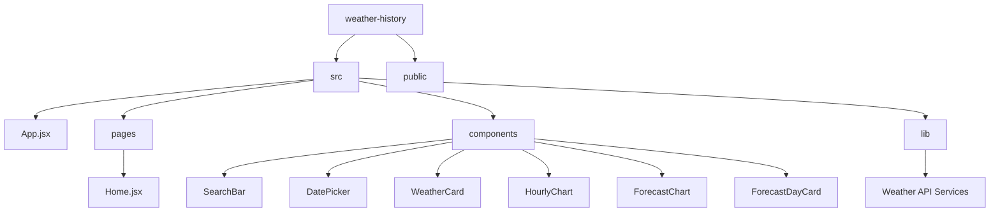
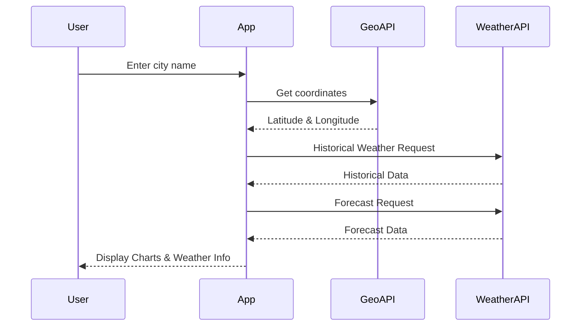
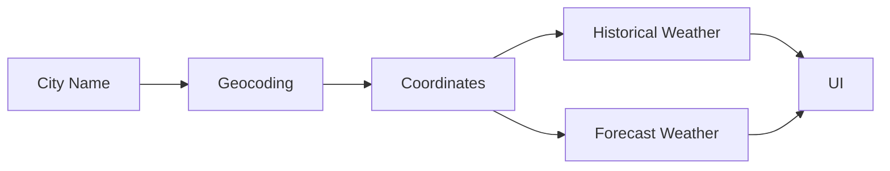

# 🌦️ Weather History & Forecast

<div align="center">

### Explore Historical Weather Data and Future Forecasts

🔗 **Live Demo:** https://weather-bay-mu-28.vercel.app/


</div>

---

## ✨ Features

- 🔍 Search weather by city name
- 📅 View historical weather for any selected date
- 📈 Interactive hourly weather charts
- 🌡️ Temperature trends and analytics
- 🌦️ 7-day weather forecast
- 💨 Wind speed and precipitation tracking
- 📱 Fully responsive design
- ⚡ Fast and lightweight Vite application

---

## 🚀 Live Demo

**Production Deployment**

👉 https://weather-bay-mu-28.vercel.app/

---

## 🏗️ System Architecture



---

## 📂 Project Structure



---

## 🔄 Application Flow



---

## 🛠️ Tech Stack

| Category | Technology |
|-----------|------------|
| Frontend | React 19 |
| Build Tool | Vite |
| Styling | Tailwind CSS |
| UI Components | Radix UI |
| Charts | Recharts |
| Animations | Framer Motion |
| State/Data Fetching | TanStack Query |
| Date Handling | date-fns |
| Routing | Wouter |
| Weather Data | Open-Meteo API |

---

## 📸 Main Features

### Historical Weather
- Select any previous date
- View temperature statistics
- Analyze hourly weather conditions
- Explore weather trends

### Forecast Dashboard
- Multi-day forecast
- Daily weather summaries
- Rainfall prediction
- Wind speed tracking

### Visual Analytics
- Interactive charts
- Temperature trends
- Weather condition insights
- Clean and responsive UI

---

## ⚙️ Installation

### Clone Repository

```bash
git clone https://github.com/YOUR_USERNAME/weather-history.git
cd weather-history
```

### Install Dependencies

```bash
npm install
```

### Start Development Server

```bash
npm run dev
```

### Build for Production

```bash
npm run build
```

### Preview Production Build

```bash
npm run preview
```

---

## 🌐 API Usage

The application uses:

- Open-Meteo Geocoding API
- Open-Meteo Historical Weather API
- Open-Meteo Forecast API



---

## 📱 Responsive Design

✅ Desktop  
✅ Laptop  
✅ Tablet  
✅ Mobile  

---

## 🚀 Deployment

This project is deployed on **Vercel**.

### Deploy Yourself

```bash
npm run build
```

Upload the generated `dist` folder to:

- Vercel
- Netlify
- GitHub Pages
- Cloudflare Pages

---

## 🤝 Contributing

Contributions are welcome.

1. Fork the repository
2. Create a feature branch
3. Commit your changes
4. Push to your branch
5. Open a Pull Request

---

## ⭐ Support

If you found this project useful:

⭐ Star the repository  
🍴 Fork the project  
📢 Share it with others

---

<div align="center">

### Built with React + Vite + Open-Meteo

🌦️ Weather History & Forecast Dashboard

**Live:** https://weather-bay-mu-28.vercel.app/

</div>
